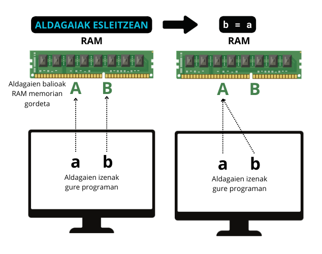
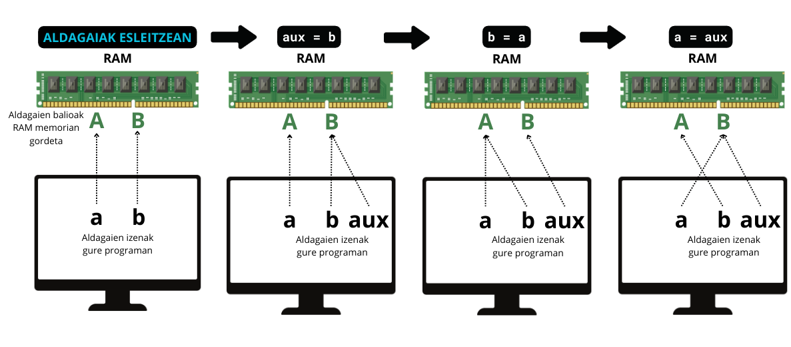

# ALDAGAIEN PORTAERA ULERTU

Kodearen helburuaren arabera, aldagai mota ezberdinak beharko ditugu. Orain arte bi ikusi ditugu: zenbakiak eta tesua, baina gehiago daude. 

- Zenbakiak
- String
- Boolearrak
- Zerrendak
- Tuplak
- Hiztegiak
- ...

Gainera, oso garrantzitsua da kode guztian zehar sortutako aldagaiak nolakoak diren jakitea, bestela oso zaila da erroreak identifikatzea.

## :arrow_right: NOLA JAKIN ZE ALDAGAI MOTA DEN?
<hr>
`type()` funtzioarekin:

```python title="aldagai_motak.py"
a = 32
b = 1.43
c = 'Kaixo, ni string (testua) naiz'
d = True
e = ['ni', 'zerrenda', 'naiz']
f = ('ni', 'tupla')
g = {'ni':'hiztegia'}

print('a-ren mota: ', type(a)) # int
print('b-ren mota: ', type(b)) # float
print('c-ren mota: ', type(c)) # str
print('d-ren mota: ', type(d)) # bool
print('e-ren mota: ', type(e)) # list
print('f-ren mota: ', type(f)) # tuple
print('g-ren mota: ', type(g)) # dict
```

## :arrow_right: METODOAK eta FUNTZIOAK ALDAGAIETAN

Honen ondoren, aldagai motak ikusten hasiko gara banan-banan. Baina garrantzitsua da hasi aurretik ulertzea Pythonek metodo eta funtzio prediseinatu (*built-in*) batzuk dituela, aldagai motaren arabera erabili ditzakegunak. 

Adibidez, `len()` **funtzioak** luzeera itzuliko dit:

```python title="funtzioak.py"
print(len('Kaixo')) # Kaixo hitzaren karaktere kopurua itzuliko dit.
```

`upper()` **metodoak** berriz, hitz bat maiuskulaz jarriko dit:
```python title="metodoak.py"
print('kaixo'.upper()) # Kaixo hitza maiuskulaz jarriko da
```

### ZERGATIK DA GARRANTZITSUA FUNTZIOAK ETA METODOAK BEREIZTEA?

##### METODOAK
Metodo bat aldagai mota bati lotuta dago beti. Hau da `str` batentzat pentsatua dagoen metodoa ezin dugu `list` batentzat erabili. 

Metodoa erabiltzeko `aldagaia.metodoaren_izena(argumentuak)` formatua erabiltzen da. Batzuetan ez dago argumentu beharrik eta orduan parentesia hutsik uzten da. Adibidez, `upper()` metodoa testuentzat soilik da. 

```python title="metodoak.py"
print('kaixo'.upper()) # Kaixo hitza maiuskulaz jarriko da
```

```python title="errorea.py"
type(['kaixo','mundua']) # list
print(['kaixo','mundua'].upper()) # Esango digu zerrenda batek ez duela upper metodoa

# 'list' object has no attribute 'upper'
```

##### FUNTZIOAK
Funtzio bat unibertsala da. Edozein aldagai motari aplikatu diezaiokegu orokorrean.
`funtzioaren_izena(aldagaiak)` formatua jarraitzen dute. Guk ikasiko dugu gure funtzio propioak sortzen, baina Pythonek guk nahi duguna egiten duen bat badauka zergatik ez erabili? *built-in functions* deitzen zaie. 

Ondorengo adibidean `len()` funtzioa erabiltzen dugu `str` baterako lehendabizi eta `list` baterako gero. Hau da, funtzioa bi aldagai mota ezberdinei aplikatu ahal izan diegu. 

```python title="funtzioak.py"
kaixo_hitzaren_luzeera = len('Kaixo') # Kaixo hitzaren karaktere kopurua itzuliko dit.
zerrenda_luzeera = len([1,2,3]) # Zerrendaren luzeera itzuliko dit
print(kaixo_hitzaren_luzeera)
print(zerrenda_luzeera) 
```

##### In-place vs. Berria itzultzea:

Metodo askok objektua aldatzen dute (in-place), funtzioek berriz, kopia bat itzultzen dute (berria). Hau ulertzeko azter dezagun ordenatzeko balio duten ondorengoak:

- `sorted()` funtzioa
- `sort()` zerrendentzako metodoa.

```python title="sorted()_funtzioa.py"
zerrenda = [5,0,7,2,9,1]
zerrenda_ordenatua = sorted(zerrenda) # Funtzioak zerrenda ordenatu du eta kopia bat eman digu guk aldagai batean gorde dezakeguna
print('Zerrenda ordenatua: ',zerrenda_ordenatua) 
print('Zerrenda originala: ',zerrenda) # Zerrenda originala berdin mantentzen da
```

```python title="sort()_metodoa_gaizki.py"
zerrenda = [5,0,7,2,9,1]
zerrenda_ordenatua = zerrenda.sort() # Metodoak zerrenda ordenatu du, baina ez digu kopia bat ematen, beraz ezin dugu aldagai batean gorde
print('Zerrenda ordenatua: ', zerrenda_ordenatua) # hutsik egongo da
print('Zerrenda originala: ',zerrenda) # Metodoa aplikatzeak zerrenda originala aldatu du
```

HORRELA EGIN BEHARKO LITZATEKE:
```python title="sort()_metodoa_ondo.py"
zerrenda = [5,0,7,2,9,1]
zerrenda.sort() # Zerrenda originala ordenatzen dugu hemen
print(zerrenda) # Zerrenda originala galdu dugu
```

Metodoak erabiltzea oso erosoa da datu originalak behar ez ditugunean. Baina datu originala galdu nahi ez dugunean ezin ditugu erabili, edota aldagai auxiliar batean gorde behar dugu originala. Badaude metodo batzuk kopia itzultzen dutenak, horregatik da hain garrantzitsua dokumentazioa irakurtzea, ulertzea eta interpretatzen jakitea. Gainera, beti egin ditzakegu frogak metodo eta funtzio bakoitzak nola funtzionatzen duen ikasteko.

!!! note "Dokumentazioa: Funtzioak eta Metodoak"
    Pythonen *built-in types* eta bakoitzaren metodoak: [https://docs.python.org/3/library/stdtypes.html](https://docs.python.org/3/library/stdtypes.html)
    
    Pythonen *built-in* funtzioak: [https://docs.python.org/3/library/functions.html](https://docs.python.org/3/library/functions.html)


## :arrow_right: NON DAUDE ALDAGAIAK KODEA EXEKUTATZEN DEN BITARTEAN?

Aldagaiak memorian gordetzen dira kodea exekutatzen den bitartean. 

- **Memoria Nagusia (RAM)**:
    Aldagaiak programa martxan dagoen bitartean RAM-ean daude.
    Adibidez: `kolorea = "urdina"` → `"urdina"` RAM-eko leku batean gordetzen da. Aldagai gehiegi edo handiegiak erabiliz gero, programa moteldu daiteke, edota memoria nahikoa ez badugu, funtzionatzeari utzi diezaioke. Horregatik garrantzitsua da ahalik eta kode optimizatuena idaztea.

- **CPU-ko Erregistroak**:
    Aldagaiak maiz erabiltzen badira, CPU-ak bere erregistroetan gorde ditzake (azkarrago exekutatzeko).


Programa amaitzen denean RAM garbitzen da: aldagai guztiak ezabatzen dira eta beste programa batzuentzat lekua askatzen da. Programa amaitzean aldagaien bat gorde nahi badugu, datu-base bat edo fitxategi bat erabili beharko dugu.

Hau ulertzeko bi aldagaien balioen trukaketa nola egiten den adierazten duen adibide bat aztertuko dugu:

Demagun hasieran `a` eta `b` aldagaiak ditugula beraien balioekin: `'A'` eta `'B'`, hurrenez hurren. Baina alderantziz izatea nahi dugu. Hau da, amaieran `a = 'B'` eta `b = 'A'`

Ezin dugu hau egin, ikusi azpiko kodea eta irudia batera:
```python title="aldagaien_trukaketa_gaizki.py"
a = 'A' # Hasierako esleipena
b = 'B' # Hasierako esleipena
b = a # b-ri 'A' jarri diogu
a = b # a-ri b jarri diogu, baina b momentu honetan 'A' da
print('b-ren balio berria: ', b)
print('a-ren balio berria: ', a)
```



Trukaketa egiteko auxiliar bat erabili beharrean gaude:

```python title="aldagaien_trukaketa_ondo.py"
a = 'A' # Hasierako esleipena
b = 'B' # Hasierako esleipena
aux = b # aux sortu b-ren baliora apuntatzen
b = a # b-ri 'A' jarri diogu
a = aux # aux aldagaiean b-ren balioa ('B') gordeta utzi dugu, beraz a horra aldatu
print('b-ren balio berria: ', b)
print('a-ren balio berria: ', a)
```



## :arrow_right: JARRI PRAKTIKAN
<hr>

##### 1.ARIKETA

Kopiatu ondoko kodea zure ordenagailuan:
```text
import random
a = random.randrange(100)
b = random.randrange(100)
c = random.randrange(100)

print('ALDAGAIEN BALIO ORIGINALA')
print('a: ', a, ', b: ', b, ', c: ', c) 

# Zure kodea hemen joango da

print('ALDAGAIEN BALIO ALDATUA')
# Hemen inprimatuko duzu
```
Kode honek a, b eta c aldagaiei 1etik 100rako ausazko zenbaki bat esleitzen die. Zuk egindako kodearen bitartez hauek trukatzea lortu behar duzu. Hau da: 

- lehen a-ren balioa zena orain b-rena izango da.
- lehen b-ren balioa zena orain c-rena izango da.
- lehen c-ren balioa zena orain a-rena izango da

Espero den emaitza horrelako zerbait izango da (ezin dut zehazki esan pythonek ausaz aukeratuko baititu balioak):
```sh
ALDAGAIEN BALIO ORIGINALA
a: 16, b: 65, c: 33
ALDAGAIEN BALIO ALDATUA
a: 33, b: 16, c: 65
```