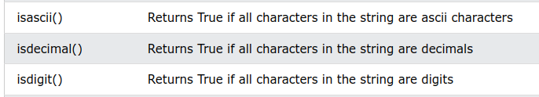

# BOOLEARRAK


!!! tip "TEORIA: aldagai boolearra"
    `True` edo `False` balioa har dezakete soilik. 

## :arrow_right: ZENBAKI KONPARAKETA
<hr>

Zenbakiak konparatzeko oso baliogarria. 

- Txikiago: `<`
- Handiago: `>`
- Txikiago edo berdin: `<=`
- Handiago edo berdin: `>=`
- Berdinak: `==`
- Ezberdinak: `!=`

```python title="zenbaki_konparazioak.py"
print(10<9)
print(10>9)
print(10<=9)
print(10>=9)
print(10<=10)
print(10==9)
print(10!=9)

```

## :arrow_right: BILAKETAK
<hr>

```python title="in.py"
esaldia = 'Kaixo, mundua'

print('Kaixo' in esaldia)
print('o, mun' in esaldia)
print('duak' in esaldia)
print('--------------------------')
print('Kontuz maiuskula/minuskula')
print('kaixo' in esaldia) # Ez du aurkituko
esaldia = esaldia.lower() # esaldi guztia minuskulara aldatu
print('kaixo' in esaldia) # Orain aurkituko du

```

```python title="not_in.py"
esaldia = 'Kaixo, mundua'

print('Kaixo' not in esaldia)
print('o, mun' not in esaldia)
print('munduak' not in esaldia)

```

## :arrow_right: AUKERA GEHIAGO
<hr>

Metodo batzuk, `True` edo `False` itzuliko digute. Betiko moduan, ezinezkoa da denak buruz jakitea, unean uneko beharrei erantzuten dietenak bilatzen eta interpretatzen jakin behar dugu. 

Adibidez:



```python title="metodo_boolear_batzuk.py"
esaldia = 'Kaixo, mundua'
string_numerikoa = '234'

print(esaldia.isascii())
print(string_numerikoa.isascii())

print(esaldia.isdigit())
print(string_numerikoa.isdigit())

print(esaldia.isdecimal())
print(string_numerikoa.isdecimal())
```
