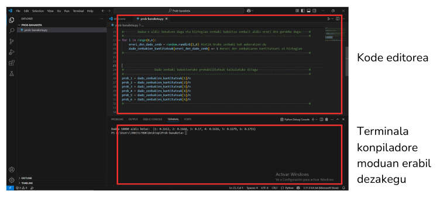
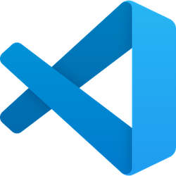
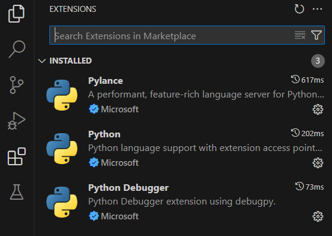
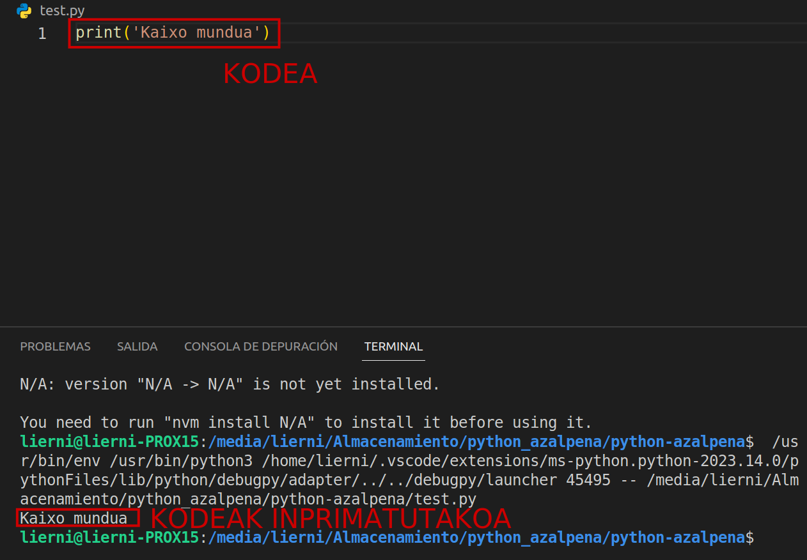
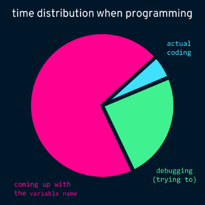

# ORDENAGAILUA PRESTATZEN

## Non idatziko dut kodigoa?
<hr>

Edozein tokitan idatzi dezakegu: bloc de notas, word, eskuz... baina horrelako tokietan ezin izango dugu gure kodeak zer egiten duen ikusi. Horretarako, konpiladore bat behar dugu. 

Visual Studio Code bezalako programek kodea idazteko eta hau konpilatzeko guneak eskaintzen dizkigute.



## Visual Studio Code
<hr>


1. Instalatu VSC.  [https://code.visualstudio.com/download](https://code.visualstudio.com/download)
2. Sortu proiektu bat. 
    - Sortu karpeta bat ordenagailuko edozein tokitan. 
    - Ireki karpeta VSC-n goiko menutik: `FILE > Open Folder` (ezkerretara menu bat irekiko da zure karpeta duena)
    - Jarri xagua ezkerreko menu lateralean eta klikatu `New File`
    - Sortu dugun dokumentuari jarri `.py` amaiera. Horrela, VSC-ek badaki Python programazio hizkuntza erabiliko dugula. 
3. Konpiladorea konfiguratu. 
    - Ordenagailuan Python eta pip ([zer da pip?](https://en.wikipedia.org/wiki/Pip_(package_manager))) instalatu. [https://www.python.org/downloads/](https://www.python.org/downloads/)
    - VSC-n Python eta Python Debugger extensioak instalatu. 
    

Editore gehiago ere existitzen dira, norbaitek probatu nahiko balituzke: Idle, PyCharm, Spyder...

## Lehen froga
<hr>

1. **VSC-n** goiko menutik terminal berri bat ireki: `TERMINAL > New Terminal`

2. Editorean kodea idatzi:
```title="froga.py"
print("Kaixo mundua")
```

3. Zapaldu <kbd>Ctrl</kbd> + <kbd>F5</kbd> kodea exekutatzeko.

4. Dena ondo joan bada, terminalean horrelako zerbait ikusi beharko genuke:
```sh
$ C:/nire_karpeta/froga.py
Kaixo mundua
```
5. VSC-n horrela ikusiko da:


## Exekutableak
Web honetan zehar jarraian ikusten den moduko "exekutableak" aurkituko dituzue. Honek konpiladore bat imitatzen du `Run Python` botoiari ematean, baina soilik kode txiki hauek frogatzeko erabil daiteke. 

```python title="froga.py"
print("Kaixo mundua")
```

!!! warning 
    `Run Python` botoi berdea ikusten ez baduzu, eguneratu web orrialdea!

## Frogak egin
<hr>

!!! error "GARRANTZITSUA"
    ### :speaker: **IKASTEKO EZINBESTEKOA DA NORBERAK KODEAREKIN FROGAK ETA FROGAK EGITEA!!!**
    ### Kode-egile onenari ere kodeak lehenengoan erroreak ematen dizkio (BETI:dizzy_face:, baita IA guztiei ere:dizzy_face::dizzy_face:). Garrantzitsua da kodearen logika ulertzea errore hauek zuzentzen joateko.
    { .centered-image }

    
### :wrench: **Nola probatu nire kodea?**  
1. **Zatika exekutatu** (debuggeatu deitzen zaio). Kodean zehar aldagaiak inprimatu daitezke kodea ondo ote doan ikusten joateko. Zerbaitek akatsa duenean programa gelditu egingo da eta errorea zein lerrotan dagoen esango digu, baita errore mota ere. VSC-ek zati bat bakarrik exekutatzeko aukera ere ematen du, hori bakarrik aztertzeko.
3. **Errore-mezuak** arretaz irakurri (Python-ek askotan soluzioa esaten du!).
2. **Aldatu parametroak** kasu desberdinak simulatzeko.  
 


